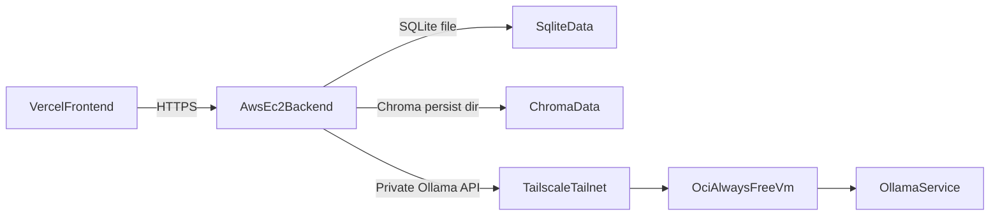

# AWS Zero-Cost Deployment Guide

This guide gives you the lowest-risk path to run this project at `$0` during the AWS free-tier period while keeping the current backend architecture mostly unchanged.

## Scope

- Frontend: deploy separately on Vercel.
- Backend: deploy on AWS EC2 free-tier compute.
- Ollama: do not host on AWS free-tier EC2. Host it on a separate zero-cost cloud VM.
- Goal: preserve the repo's current Ollama-based integration instead of rewriting the backend around Bedrock, SageMaker, or an OpenAI-compatible API.

## Executive Summary

The best practical architecture for this repo is:

1. Host the backend on a small AWS EC2 instance.
2. Host Ollama on an OCI Always Free VM.
3. Connect AWS to OCI privately with Tailscale.
4. Use `qwen2.5:3b` for chat and `nomic-embed-text` for embeddings.

This is the best fit because the backend currently talks to the Ollama HTTP API directly through `ChatOllama` and `OllamaEmbeddings`, not through Bedrock or OpenAI-style endpoints. You can see that in `backend/app/services/ollama_client.py`, `backend/app/tools/rag.py`, and the health check in `backend/app/api/health.py`.

## Recommended Architecture



## Automation Option

If you want SDK-based provisioning helpers instead of creating the base infrastructure by hand, use the toolkit in `backend/deploy/`.

It includes:

- `backend/deploy/scripts/provision_aws_backend.py`
- `backend/deploy/scripts/provision_aws_ollama.py` (optional: second EC2 for Ollama in the same VPC)
- `backend/deploy/scripts/provision_oci_ollama.py`
- `backend/deploy/README.md`

Those scripts provision the base AWS and OCI infrastructure, and they read cloud credentials from `backend/deploy/.env`. This guide still covers the remaining manual steps such as Tailscale approval, DuckDNS, TLS, backend `.env`, and optional OAuth.

### All-AWS option: API EC2 + Ollama EC2

If you do not want OCI, run both `provision_aws_backend.py` and `provision_aws_ollama.py` in the **same region and VPC**. Put the Ollama instance in a subnet the backend can reach (often a private subnet). Set `OLLAMA_BASE_URL` on the API host to `http://<ollama-private-ip>:11434`. The Ollama provisioner security group only opens port `11434` to your backend security group (and optionally your VPC CIDR). The Ollama EC2 is usually **not** free-tier-sized if you want acceptable model performance; size it to your budget.


## Why This Architecture

### Why not AWS free-tier EC2 for Ollama

AWS free-tier-sized instances are fine for a lightweight Python API, but not for a useful Ollama setup. A typical free-tier EC2 instance does not have enough RAM or CPU headroom for a good self-hosted chat model plus embeddings plus the rest of your app.

Even if you force a tiny model onto a micro instance, it will usually be too slow to feel good in chat and too fragile under concurrent requests.

### Why not SageMaker

SageMaker can be good for experiments, but it does not solve your main requirement:

- it is not a permanent zero-cost inference platform
- it is based on time-limited free usage or credits
- it is not Ollama-compatible out of the box
- it would push you toward a different serving stack

If your goal is "keep this repo architecture and stay at $0", SageMaker is not the right primary plan.

### Why not Bedrock

Bedrock is a managed inference API, not an Ollama host. It can be excellent when you are willing to pay and adjust the code, but it is not the right answer for this repo if you want:

- sustained zero-cost usage
- no token billing surprises
- no large code rewrite
- an `OLLAMA_BASE_URL` that still works

### Why OCI Always Free is the best Ollama host here

OCI Always Free is a better match for zero-cost Ollama hosting because it offers enough CPU and RAM to run a small quantized model for personal use, and it is not tied to a short-lived credit window the way AWS AI services usually are.

That gives you a clean split:

- AWS runs the lightweight backend.
- OCI runs the heavy model process.

## Model Recommendation

### Primary model

Use:

- `qwen2.5:3b` for chat
- `nomic-embed-text` for embeddings

Why `qwen2.5:3b`:

- much lighter than `llama3.1`
- better fit for CPU-only zero-cost hosting
- faster first token and better latency on free hardware
- usually the best quality/speed tradeoff for this kind of hobby deployment

### Fallbacks

- `phi3:mini` if you want a small reasoning-focused alternative
- `llama3.1` only if you later move Ollama to stronger paid hardware

### Recommended runtime tuning

To keep latency lower on a free VM:

- keep `OLLAMA_NUM_CTX=2048` at first
- keep `AGENT_MAX_TURNS` modest, for example `4`
- keep scheduler disabled until the base deployment is stable

## Repo Constraints That Matter In Production

### Ollama is required today

The backend is wired to Ollama through:

- `backend/app/services/ollama_client.py`
- `backend/app/tools/rag.py`
- `backend/app/api/health.py`

### Storage is local-disk based

This backend uses local persistence, not managed AWS databases:

- SQLite database file under `backend/data`
- Chroma persistence directory under `backend/data/chroma`

This comes from:

- `backend/app/db/session.py`
- `backend/app/core/config.py`

### Scheduler is in-process

The scheduler starts inside the API app lifecycle from `backend/app/main.py`, so this deployment should stay single-instance. Do not run multiple backend replicas unless you first redesign scheduler ownership and local-disk storage.

## Cost Reality

### What can be truly `$0`

- AWS backend: `$0` during your AWS free-tier period if you stay within the included compute and storage limits
- OCI Ollama host: intended to stay `$0` on Always Free if you stay inside Always Free limits
- Vercel frontend: you said you will handle this separately

### What is not permanent `$0`

- AWS EC2 after the free-tier period ends
- SageMaker inference after free credits/hours expire
- Bedrock usage after credits expire
- Route 53 hosted zones
- NAT Gateway
- Load Balancer
- RDS
- paid snapshot growth

## AWS Backend Design

### Recommended AWS instance

Use one small Ubuntu EC2 instance for the backend only.

Recommended shape:

- `t3.micro` on legacy 12-month free tier accounts
- if your AWS account is on the post-2025 credit model instead of the old 12-month model, keep the same design but verify the instance stays inside your included credits

Recommended OS:

- Ubuntu 24.04 LTS

Recommended storage:

- `20 GB gp3` root volume to stay conservative

This backend does not need much CPU. The main reason to keep it separate from Ollama is stability.

### Network design

- Put the EC2 instance in a public subnet.
- Give it a public IPv4 address.
- Use a security group with only web ports open.
- Use Session Manager instead of public SSH.

### IAM instance profile

Attach only this AWS managed policy to the EC2 instance role:

- `AmazonSSMManagedInstanceCore`

Do not attach broad policies like:

- `AdministratorAccess`
- `AmazonS3FullAccess`
- `AmazonEC2FullAccess`

You do not need them for this deployment.

If you create the role manually, the trust relationship should allow EC2 to assume it:

```json
{
  "Version": "2012-10-17",
  "Statement": [
    {
      "Effect": "Allow",
      "Principal": {
        "Service": "ec2.amazonaws.com"
      },
      "Action": "sts:AssumeRole"
    }
  ]
}
```

### Security group rules

Use a security group like this:


| Direction | Port   | Source      | Purpose                                                                 |
| --------- | ------ | ----------- | ----------------------------------------------------------------------- |
| Inbound   | `80`   | `0.0.0.0/0` | HTTP for initial certificate issuance and redirect                      |
| Inbound   | `443`  | `0.0.0.0/0` | HTTPS API traffic                                                       |
| Inbound   | `22`   | none        | Keep closed if using SSM only                                           |
| Inbound   | `8000` | none        | Never expose Uvicorn directly                                           |
| Outbound  | all    | `0.0.0.0/0` | Package install, OCI/Tailscale/Ollama reachability, Google OAuth, feeds |


## AWS Backend Step-By-Step

### 1. Create the EC2 instance

In AWS:

1. Launch an EC2 instance with Ubuntu 24.04 LTS.
2. Choose `t3.micro`.
3. Use `20 GB gp3` storage.
4. Enable auto-assign public IP.
5. Attach an IAM role with `AmazonSSMManagedInstanceCore`.
6. Attach the security group described above.
7. Do not add a Load Balancer, NAT Gateway, RDS, or EIP unless you deliberately accept possible cost.

### 2. Connect through Session Manager

From the AWS console:

1. Open EC2.
2. Select the instance.
3. Click `Connect`.
4. Choose `Session Manager`.

This avoids opening port `22`.

### 3. Install system packages

```bash
sudo apt update
sudo apt install -y git python3 python3-venv python3-pip build-essential nginx certbot python3-certbot-nginx
```

### 4. Clone the backend code

Adjust the repo URL to your backend repository:

```bash
sudo mkdir -p /opt/ai-trading-assistant
sudo chown -R $USER:$USER /opt/ai-trading-assistant
cd /opt/ai-trading-assistant
git clone <YOUR_BACKEND_REPO_URL> backend
cd backend
python3 -m venv .venv
source .venv/bin/activate
pip install --upgrade pip
pip install -e .
mkdir -p data
```

If you are not cloning from git, copy the `backend` directory here with `scp`, `rsync`, or upload-and-unzip through SSM.

### 5. Create the backend environment file

```bash
cd /opt/ai-trading-assistant/backend
cp .env.example .env
```

Do not fill it in yet. First build the OCI Ollama VM and Tailscale link, then come back and insert the real values.

### 6. Start the API with Uvicorn (before Nginx)

Nginx proxies to `127.0.0.1:8000`, but **nothing listens until Uvicorn runs**. If `curl http://127.0.0.1:8000/health` returns *connection refused*, start the app (foreground test below or systemd) before debugging Nginx.

**Foreground sanity check** (second SSM session for `curl`; Ctrl+C stops the server):

```bash
cd /opt/ai-trading-assistant/backend
source .venv/bin/activate
export PYTHONUNBUFFERED=1
uvicorn app.main:app --host 127.0.0.1 --port 8000
```

```bash
curl -sS http://127.0.0.1:8000/health
```

**Production:** use the systemd unit below and enable it. For failures, use `sudo journalctl -u ai-trading-backend -n 80 --no-pager`.

Create `/etc/systemd/system/ai-trading-backend.service`:

```ini
[Unit]
Description=AI Trading Assistant FastAPI Backend
After=network.target

[Service]
Type=simple
User=ubuntu
WorkingDirectory=/opt/ai-trading-assistant/backend
Environment=PYTHONUNBUFFERED=1
ExecStart=/opt/ai-trading-assistant/backend/.venv/bin/uvicorn app.main:app --host 127.0.0.1 --port 8000
Restart=always
RestartSec=5

[Install]
WantedBy=multi-user.target
```

Then enable it:

```bash
sudo systemctl daemon-reload
sudo systemctl enable ai-trading-backend
sudo systemctl start ai-trading-backend
sudo systemctl status ai-trading-backend
curl -sS http://127.0.0.1:8000/health
```

### 7. Configure Nginx

Configure Nginx **after** `curl http://127.0.0.1:8000/health` works on the instance.

Create `/etc/nginx/sites-available/ai-trading-backend`:

```nginx
server {
    listen 80;
    server_name api-example.duckdns.org;

    client_max_body_size 10m;

    location / {
        proxy_pass http://127.0.0.1:8000;
        proxy_http_version 1.1;
        proxy_set_header Host $host;
        proxy_set_header X-Real-IP $remote_addr;
        proxy_set_header X-Forwarded-For $proxy_add_x_forwarded_for;
        proxy_set_header X-Forwarded-Proto $scheme;
        proxy_read_timeout 3600;
        proxy_send_timeout 3600;
        proxy_buffering off;
    }
}
```

Enable the site:

```bash
sudo ln -s /etc/nginx/sites-available/ai-trading-backend /etc/nginx/sites-enabled/ai-trading-backend
sudo nginx -t
sudo systemctl reload nginx
```

### 8. Add a free hostname and TLS

Because your frontend is on Vercel over HTTPS, your backend must also be HTTPS.

For a zero-cost hostname, use one of:

- a free `duckdns.org` hostname
- a domain you already own

If using DuckDNS:

1. create a free hostname such as `api-example.duckdns.org`
2. point it to the EC2 public IP
3. wait for DNS to resolve

Then issue the TLS certificate:

```bash
sudo certbot --nginx -d api-example.duckdns.org
```

Choose the redirect-to-HTTPS option when prompted.

### 9. Backend service logs

Useful commands:

```bash
sudo systemctl status ai-trading-backend
sudo journalctl -u ai-trading-backend -n 100 --no-pager
sudo tail -n 100 /var/log/nginx/access.log
sudo tail -n 100 /var/log/nginx/error.log
```

## OCI Always Free Ollama Design

### Recommended OCI shape

Use an OCI Always Free Ampere A1 VM shape within the Always Free allowance.

A practical starting point:

- `VM.Standard.A1.Flex`
- `4 OCPU`
- `24 GB RAM`

This is enough for a small quantized model and embeddings for personal use.

### Storage guidance

Keep total storage conservative. Model files can grow quickly.

Good starting point:

- `80 GB` boot volume if available inside your free allowance

Do not keep pulling many large models. Remove anything you are not using.

### OCI network guidance

Preferred path:

- keep Ollama private to your tailnet
- do not expose raw `11434` publicly

If you later choose to expose Ollama publicly, put HTTPS and authentication in front of it first. Raw public Ollama exposure is a bad idea.

For the private Tailscale path, your OCI network rules do not need to expose `11434` to the internet.

## OCI Ollama Step-By-Step

### 1. Create the OCI instance

In OCI:

1. Create a compute instance in your home region.
2. Pick the Always Free `VM.Standard.A1.Flex` shape.
3. Allocate enough memory for the selected shape, for example `4 OCPU / 24 GB`.
4. Keep networking simple with a public IP.
5. Avoid extra attached services that are not Always Free.

### 2. Install Ollama

On the OCI VM:

```bash
curl -fsSL https://ollama.com/install.sh | sh
sudo systemctl enable ollama
sudo systemctl start ollama
sudo systemctl status ollama
```

### 3. Pull the models

```bash
ollama pull qwen2.5:3b
ollama pull nomic-embed-text
```

Optional fallback:

```bash
ollama pull phi3:mini
```

### 4. Verify Ollama locally

```bash
curl http://127.0.0.1:11434/api/tags
ollama run qwen2.5:3b "Say hello in one sentence."
```

### 5. Keep the Ollama service private

You want AWS to reach OCI, but you do not want the public internet to hit Ollama directly.

The easiest zero-cost option is Tailscale.

If you use a host firewall on OCI, keep it minimal. Example with UFW:

```bash
sudo apt update
sudo apt install -y ufw
sudo ufw default deny incoming
sudo ufw default allow outgoing
sudo ufw allow OpenSSH
sudo ufw enable
sudo ufw status verbose
```

Do not add a public `11434` allow rule.

## Private AWS-to-OCI Connectivity With Tailscale

### Why Tailscale

It is simple, free for small personal use, and avoids exposing port `11434` to the public internet.

### Install Tailscale on the AWS backend

```bash
curl -fsSL https://tailscale.com/install.sh | sh
sudo tailscale up
tailscale ip -4
```

### Install Tailscale on the OCI Ollama host

```bash
curl -fsSL https://tailscale.com/install.sh | sh
sudo tailscale up
tailscale ip -4
```

Approve both devices in your Tailscale admin console if prompted.

### Test private Ollama reachability

From the AWS EC2 backend:

```bash
curl http://<OCI_TAILSCALE_IP>:11434/api/tags
```

This should return the model list.

If it fails:

- check both machines are connected to the same tailnet
- verify the OCI host firewall is not blocking local service access
- verify `ollama` is running

## Backend Environment Configuration

This repo reads settings from `backend/.env` through `backend/app/core/config.py`.

The production values below are the important ones for this architecture:

```env
# Ollama
OLLAMA_BASE_URL=http://100.x.y.z:11434
OLLAMA_MODEL=qwen2.5:3b
OLLAMA_EMBEDDING_MODEL=nomic-embed-text
OLLAMA_TEMPERATURE=0.3
OLLAMA_NUM_CTX=2048
AGENT_MAX_TURNS=4

# Logging
LOG_LEVEL=INFO

# Local storage on AWS EC2
DATABASE_URL=sqlite+aiosqlite:///./data/trading_assistant.db
CHROMA_PERSIST_DIR=./data/chroma
RAG_TOP_K=4

# Frontend and CORS
FRONTEND_URL=https://your-vercel-app.vercel.app
CORS_ORIGINS=https://your-vercel-app.vercel.app

# Auth cookies for HTTPS + cross-site frontend
AUTH_COOKIE_SECURE=true
AUTH_COOKIE_SAMESITE=none

# Optional Google OAuth
GOOGLE_CLIENT_ID=
GOOGLE_CLIENT_SECRET=
GOOGLE_REDIRECT_URI=https://api-example.duckdns.org/api/auth/google/callback
AUTH_JWT_SECRET=replace-with-a-long-random-secret
AUTH_JWT_ALGORITHM=HS256
AUTH_JWT_EXPIRE_DAYS=7

# Start with scheduler off, then enable later if stable
SCHEDULER_ENABLED=false
SCHEDULER_CRON=0 9,21 * * *
```

Notes:

- `DATABASE_URL` and `CHROMA_PERSIST_DIR` are intentionally local because this repo is built around local persistence.
- `backend/app/db/session.py` rewrites relative SQLite paths so the file lives under the backend root.
- `AUTH_COOKIE_SAMESITE=none` and `AUTH_COOKIE_SECURE=true` are required for a Vercel frontend talking to a different HTTPS origin.

## Initial Safe Bring-Up

Do the first deployment in the simplest possible mode:

1. get HTTPS working on the backend
2. point `OLLAMA_BASE_URL` to the OCI Tailscale IP
3. leave Google OAuth disabled
4. leave scheduler disabled
5. validate chat and health endpoints first

That lets you prove the core path before adding cross-site auth complexity.

## Apply The Backend Environment

Edit `/opt/ai-trading-assistant/backend/.env` and set the real values.

Then restart:

```bash
sudo systemctl restart ai-trading-backend
sudo systemctl status ai-trading-backend
sudo journalctl -u ai-trading-backend -n 100 --no-pager
```

## Google OAuth Production Notes

Only enable Google OAuth after the backend base URL and HTTPS are stable.

If you enable Google OAuth:

- set `FRONTEND_URL` to the exact Vercel frontend URL
- set `CORS_ORIGINS` to only the exact allowed frontend origins
- set `GOOGLE_REDIRECT_URI` to `https://<your-backend-domain>/api/auth/google/callback`
- set `AUTH_COOKIE_SECURE=true`
- set `AUTH_COOKIE_SAMESITE=none`
- set a strong `AUTH_JWT_SECRET`

If you do not need sign-in immediately, stay in demo-user mode first. That is the easiest zero-cost rollout.

## Health Checks And Validation

### 1. Backend liveness

```bash
curl https://api-example.duckdns.org/health
```

Expected:

```json
{"status":"ok"}
```

### 2. Backend dependency health

```bash
curl https://api-example.duckdns.org/api/health
```

Expected:

- database should be `ok`
- ollama should be `ok`

### 3. Ollama reachability from AWS

From EC2:

```bash
curl http://<OCI_TAILSCALE_IP>:11434/api/tags
```

### 4. Scheduler test

Only after the backend is stable:

```bash
curl -X POST https://api-example.duckdns.org/api/jobs/trigger-analysis
```

### 5. Verify local persistence

On the AWS EC2 instance:

```bash
ls -lah /opt/ai-trading-assistant/backend/data
du -sh /opt/ai-trading-assistant/backend/data
```

You should see the SQLite file and Chroma data appear over time.

## Security And Policy Checklist

### AWS IAM

- use an EC2 instance profile with `AmazonSSMManagedInstanceCore` only
- do not use access keys on the instance
- do not attach admin policies

### AWS security groups

- allow only `80` and `443` inbound
- keep `22` closed if using SSM
- never expose `8000`

### Host hardening

- keep Ubuntu packages updated
- keep Python dependencies limited to what the backend needs
- run Uvicorn behind Nginx
- use HTTPS everywhere exposed to browsers

### OCI hardening

- do not expose raw `11434` publicly
- prefer Tailscale private connectivity
- keep only the required models installed
- patch the VM periodically

### Application hardening

- narrow `CORS_ORIGINS`
- use a strong `AUTH_JWT_SECRET` before enabling Google OAuth
- do not store secrets in git
- keep scheduler off until the core app path is stable

## Zero-Cost Guardrails

### AWS services to avoid

Do not create these unless you knowingly accept cost risk:

- NAT Gateway
- Application Load Balancer
- Route 53 hosted zone
- RDS
- ElastiCache
- SageMaker endpoints
- CloudWatch agents or noisy custom log shipping
- extra EBS volumes and large snapshots

### EC2 cost guardrails

- stop at one backend instance
- keep root disk modest, for example `20 GB gp3`
- do not allocate an Elastic IP and then leave it unattached
- monitor disk usage under `backend/data`
- avoid automatic snapshot habits unless you are intentionally tracking their cost

### OCI cost guardrails

- stay inside Always Free compute shapes
- avoid attaching extra paid block volumes
- keep only a few small Ollama models on disk
- periodically delete unused models with `ollama rm <model>`

## Operational Limits Of This Setup

This deployment is good for a personal project or a low-traffic demo, but it is not a high-availability architecture.

Main limitations:

- SQLite is local to one machine
- Chroma is local to one machine
- scheduler runs inside the API process
- there is no shared queue or worker tier
- there is no autoscaling

That is acceptable for the zero-cost goal, but it is important to understand the boundary.

## Backup Guidance

Because this deployment uses local SQLite and local Chroma storage, backups are your responsibility.

Low-cost approach:

1. stop the backend briefly
2. create a compressed archive
3. download it to your own machine
4. start the backend again

Example:

```bash
sudo systemctl stop ai-trading-backend
cd /opt/ai-trading-assistant/backend
tar -czf backup-$(date +%F).tar.gz data
sudo systemctl start ai-trading-backend
```

This is often safer for a zero-cost setup than creating recurring paid cloud backups and forgetting about them.

## Troubleshooting

### `api/health` shows `ollama: error`

Check:

```bash
curl http://<OCI_TAILSCALE_IP>:11434/api/tags
sudo systemctl status ai-trading-backend
sudo systemctl status ollama
```

Likely causes:

- wrong `OLLAMA_BASE_URL`
- Tailscale not connected
- OCI VM not running
- model host overloaded

### backend service does not start

Check:

```bash
sudo journalctl -u ai-trading-backend -n 200 --no-pager
```

Common causes:

- broken `.env`
- missing Python dependency
- permissions under `/opt/ai-trading-assistant/backend`

### Nginx fails

Check:

```bash
sudo nginx -t
sudo systemctl status nginx
sudo tail -n 100 /var/log/nginx/error.log
```

### disk fills up

Check:

```bash
df -h
du -sh /opt/ai-trading-assistant/backend/data
ollama list
```

Space is usually consumed by:

- Chroma persistence
- SQLite growth
- unused Ollama models
- package caches or logs

## Recommended Rollout Order

1. Create the AWS backend EC2 instance.
2. Create the OCI Always Free VM.
3. Install Ollama on OCI and pull `qwen2.5:3b` and `nomic-embed-text`.
4. Install Tailscale on both VMs.
5. Verify `curl http://<OCI_TAILSCALE_IP>:11434/api/tags` from AWS.
6. Install and configure the backend on AWS.
7. Put Nginx and TLS in front of the backend.
8. Verify `/health` and `/api/health`.
9. Point the Vercel frontend to the HTTPS backend URL.
10. Enable Google OAuth later if needed.
11. Enable scheduler later if needed.

## Final Checklist

- AWS EC2 backend is running on a free-tier-safe instance
- IAM role has only `AmazonSSMManagedInstanceCore`
- security group exposes only `80` and `443`
- backend is served through Nginx over HTTPS
- backend `.env` points `OLLAMA_BASE_URL` to OCI over Tailscale
- Ollama is running on OCI Always Free
- `qwen2.5:3b` and `nomic-embed-text` are pulled
- `/health` returns `ok`
- `/api/health` returns database `ok` and ollama `ok`
- no paid AWS extras were created accidentally

## Recommended Default Decision

If you want the fastest path that still matches your zero-cost goal, use this exact default:

- AWS EC2 `t3.micro` Ubuntu 24.04 for backend
- OCI Always Free `VM.Standard.A1.Flex` for Ollama
- `qwen2.5:3b` as the chat model
- `nomic-embed-text` as the embedding model
- Tailscale between AWS and OCI
- DuckDNS plus Nginx plus Certbot for free HTTPS
- Google OAuth disabled initially
- scheduler disabled initially

That is the cleanest way to get this project online without turning the architecture into something else or drifting into paid AWS AI services.